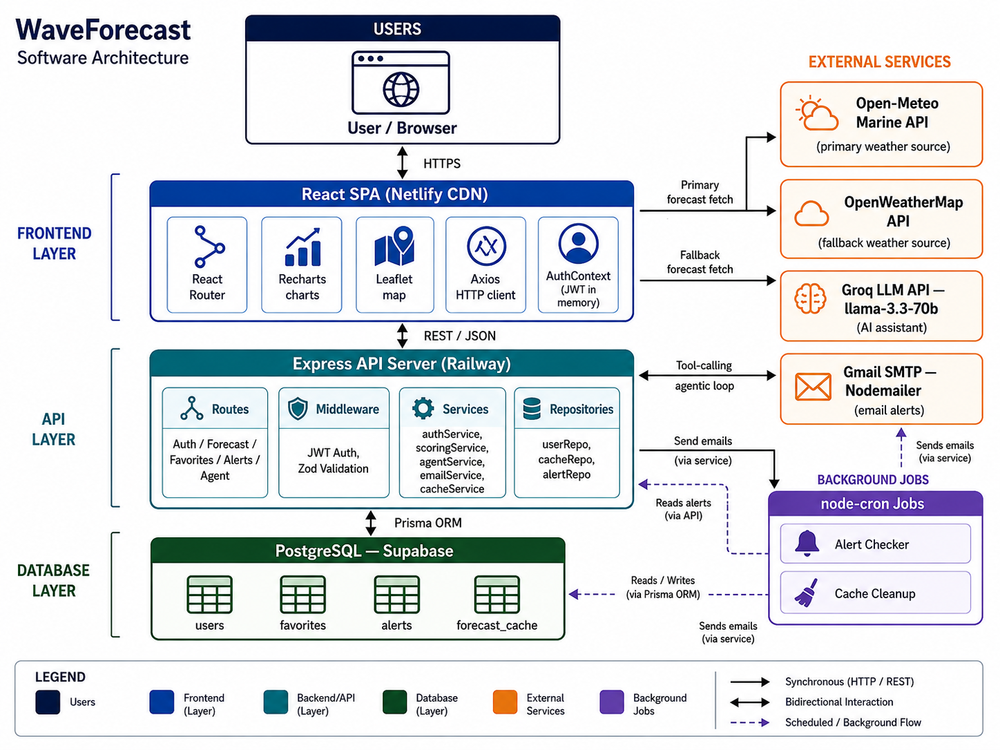

# WaveCast

A free, open-source surf forecasting web application - a transparent alternative to Surfline.
Real-time wave forecasts, surf spot ratings, personalized alerts, and tide charts with no paywall.

**Live demo:** [wavecast-tomeratia.netlify.app](https://wavecast-tomeratia.netlify.app)

---



---

## Features

- **Wave forecasts** - 7-day hourly forecasts powered by Open-Meteo Marine API
- **Surf scoring** - transparent, configurable algorithm (swell height, period, wind, tide)
- **Tide charts** - sea level data with high/low markers
- **Email alerts** - get notified by email when a spot reaches your target score, with time-of-day filtering (dawn, morning, noon, sunset, or any time)
- **Favorites** - save and track preferred surf spots
- **AI assistant** - natural language surf condition queries (Groq / llama-3.3-70b)
- **Unit system** - metric (m, km/h) and imperial (ft, mph, kts) support
- **Responsive** - mobile-first design with hamburger navigation

---

## Tech Stack

| Layer | Technology |
|---|---|
| Frontend | React 18, Vite, Tailwind CSS, Recharts, Leaflet |
| Backend | Node.js, Express, TypeScript |
| Database | PostgreSQL (Supabase), Prisma ORM |
| Auth | JWT (access token in memory + refresh token in httpOnly cookie) |
| Weather data | Open-Meteo Marine API (primary), OpenWeatherMap (wind/temp) |
| Email | Brevo transactional API |
| Deployment | Netlify (client) + Railway (server) |

---

## Project Structure

```
wavecast/
├── client/          # React frontend (Vite + Tailwind CSS)
├── server/          # Express backend
├── shared/          # Shared TypeScript types (DTOs)
├── prisma/          # Database schema + migrations
└── package.json     # Monorepo root (npm workspaces)
```

### Architecture layers

```
Routes -> Services -> Repositories -> Prisma/Supabase
```

- Only `server/repositories/` imports Prisma
- Only `server/adapters/` calls external weather APIs
- All forecast requests go through a 3-hour PostgreSQL cache layer

---

## Getting Started

### Prerequisites

- Node.js >= 18
- PostgreSQL database (Supabase recommended)

### Installation

```bash
git clone https://github.com/Tomeratia/WaveCast.git
cd WaveCast
npm install
```

### Environment variables

```bash
cp .env.example .env
```

Fill in the required values in `.env`:

| Variable | Required | Description |
|---|---|---|
| `DATABASE_URL` | Yes | PostgreSQL connection string |
| `JWT_SECRET` | Yes | Min 32 characters |
| `OPENWEATHER_API_KEY` | Optional | Wind speed and air temperature data |
| `GROQ_API_KEY` | Optional | AI assistant |
| `BREVO_API_KEY` | Optional | Email alerts |
| `BREVO_FROM_EMAIL` | Optional | Sender address for alert emails |

### Database setup

```bash
npx prisma migrate dev
npx prisma generate
```

### Run in development

```bash
# Terminal 1 - backend (port 3001)
npm run dev:server

# Terminal 2 - frontend (port 5173)
npm run dev:client
```

---

## Surf Scoring Algorithm

The rating algorithm is fully transparent and defined in `server/config/scoring.ts`:

| Factor | Weight | Rationale |
|---|---|---|
| Swell height | 35% | Primary wave size indicator |
| Swell period | 30% | Wave quality (longer = cleaner) |
| Wind speed | 15% | Surface conditions |
| Wind direction | 10% | Offshore vs onshore |
| Tide | 10% | Water level impact |

Score output: integer in **[0, 100]** mapped to `flat / poor / fair / good / epic`.

---

## Surf Alerts

Alerts are checked every 30 minutes between 05:00-20:00 (Israel time). When a spot's score meets the user's minimum threshold and falls within the chosen time window, a single email is sent. Alerts are rate-limited to one email per spot per day to prevent spam.

**Time window options:**

| Option | Hours (Israel time) |
|---|---|
| Dawn patrol | 05:00 - 09:00 |
| Morning | 09:00 - 13:00 |
| Noon | 13:00 - 16:00 |
| Sunset | 16:00 - 19:00 |
| Any time | All day |

---

## API Endpoints

All protected routes require `Authorization: Bearer <token>`.

| Method | Path | Auth | Description |
|---|---|---|---|
| POST | `/api/auth/register` | Public | Create account |
| POST | `/api/auth/login` | Public | Login - access token + refresh cookie |
| POST | `/api/auth/refresh` | Public | Refresh access token |
| GET | `/api/forecast/:spotId` | Protected | Forecast + score (cache-first) |
| GET | `/api/spots` | Protected | List all surf spots |
| GET | `/api/favorites` | Protected | User's favorite spots |
| POST | `/api/favorites/:spotId` | Protected | Add favorite |
| DELETE | `/api/favorites/:spotId` | Protected | Remove favorite |
| GET | `/api/alerts` | Protected | User's alerts |
| POST | `/api/alerts` | Protected | Create alert |
| PUT | `/api/alerts/:alertId` | Protected | Update alert |
| DELETE | `/api/alerts/:alertId` | Protected | Delete alert |

---

## Data Sources

| Source | Data | Rate limit |
|---|---|---|
| [Open-Meteo Marine](https://marine-api.open-meteo.com) | Wave height, period, direction, sea temperature, tides | 10,000/day - no key needed |
| [OpenWeatherMap](https://openweathermap.org/api) | Wind speed, air temperature, pressure | 60 req/min (free tier) |

All data is cached in PostgreSQL for 3 hours. On first load, some spots may briefly show missing wind/temperature if the OpenWeatherMap rate limit is hit - this resolves automatically once the cache is populated.

---

## License

MIT
